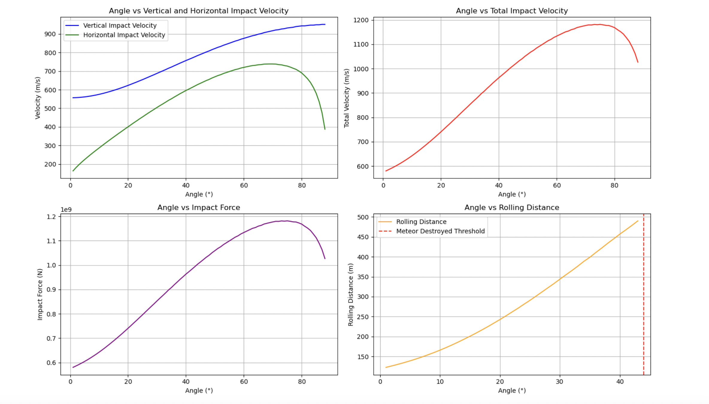

# Simulating Meteor Descent and Impact 🚀🌍

This project models the descent and surface interaction of a meteor entering Earth's atmosphere. Using a physics-based approach in Python, the simulation explores how different entry angles and initial velocities affect impact behavior, bounce dynamics, and post-impact motion (e.g., rolling distance). It accounts for gravitational acceleration, atmospheric drag (air resistance), and energy loss upon impact.

## 🔬 Key Physics Features

- **Atmospheric drag**: Air resistance modeled as a velocity-dependent force, reducing terminal velocity and altering descent profiles
- **Variable entry angles**: Simulates the meteor's path from shallow to steep angles and analyzes how angle affects speed, force of impact, and post-impact motion
- **Impact physics**:
  - Checks if the meteor survives impact using a rigid-body assumption (vs. disintegrating due to excessive force)
  - Computes energy lost at impact
  - Calculates how high the meteor bounces (if it does)
  - Tracks **subsequent rolling distance** based on remaining energy
- **Descent and post-impact tracking**:
  - Time-evolution of height, speed, and acceleration
  - Impact speed and location
  - Post-impact velocity and behavior

## 📊 Visual Output
Plots include:
- Descent trajectory over time
- Velocity and acceleration profiles
- Bounce height vs. impact energy
- Distance traveled on the ground post-impact
- Threshold for meteor destruction

  
*Simulated descent and impact trajectory under atmospheric drag at a 45° entry angle.*

## 📁 Included Files

- `Simulating_Meteor_Impacts.ipynb`: Main Jupyter Notebook with annotated code, equations, simulations, and plots
- `Resubmission_Meteor_Descent.html`: Exported notebook in HTML format for easy preview without needing Jupyter

## ▶️ How to Run

1. **Clone the repository**:
   ```bash
   git clone https://github.com/Alexk6147/SimulatingMeteorImpacts.git
   cd SimulatingMeteorImpacts